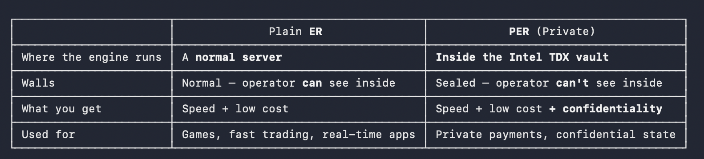

# Confidential computing

Instead of mixing money out in the open, MagicBlock takes your transaction off the public wall entirely and runs it inside a sealed, private computer that nobody — not even the people operating it — can look inside. Only the final result comes back out to the public chain.

Analogy: instead of trading on the glass-walled floor, you step into a windowless vault, do the deal inside, and walk out. People see you went in and came out — but have no idea what happened in there.

MagicBlock makes a transaction private not by hiding it in a crowd, but by running it inside a hardware "black box" that even its own operators can't see into — then publishing only the result

That black box is called a TEE — and it's the entire heart of MagicBlock.

## What a TEE Actually Is

**TEE** = Trusted Execution Environment

Here's the problem: on a normal computer, the OS — and whoever owns/runs that machine — can see everything in RAM. So if your transaction is processed on someone else's server, the operator of that server can, in principle, peek into memory and read your data while it's being worked on. There is no privacy during processing. The machine's owner is all-powerful.

The specific brand MagicBlock uses: **Intel TDX**

- **Intel** = the company that makes the CPU chips.
- **TDX** = "Trust Domain Extensions" = Intel's specific technology for building these vaults.

Intel actually has two versions of this vault tech, and the difference is the reason MagicBlock made a choice:

- **SGX (older)** → seals just a tiny piece of one program. Small vault, awkward to use (you have to surgically split your app into "inside" and "outside" parts).
- **TDX (newer — what MagicBlock uses)** → seals an entire virtual computer at once. A virtual computer (VM) is a complete computer — its own OS and programs — running as software inside a physical machine. TDX wraps that whole VM in the vault.

Why MagicBlock needs TDX specifically: the thing they run inside the vault is a big, complex piece of software (a whole Solana transaction-processing engine). Way too big to cram into SGX's tiny vault. TDX lets them drop the entire engine into a sealed VM with barely any changes. That's the whole reason for the choice.

## What an "Ephemeral Rollup" is?

MagicBlock's original invention, which is about speed and cost, not privacy.

the shared public chain is great for safety, but bad for speed.

The idea: Temporarily take a few specific accounts off the busy public chain, run them in a private high-speed lane that's basically free, then put the final results back on the chain.

That high-speed lane is the Ephemeral Rollup (ER). Let's break down the name:

- **Rollup** = a well-known blockchain pattern: do lots of transactions off the main chain, then "roll them up" and post the result back to the main chain. The main chain stays the source of truth; the heavy work happens elsewhere.
- **Ephemeral** = temporary, short-lived. MagicBlock spins one of these lanes up when you need it and tears it down when you're done — it's not a permanent separate blockchain.

First, two terms:

- **Account** = a storage slot on Solana that holds data or a balance. (MagicBlock specifically borrows program-controlled accounts called PDAs — for now just read "PDA" as "a data account managed by an app.")
- **Validator / operator** = the server that runs the ER lane. (Also called the sequencer — it puts transactions in order.)

Now the lifecycle:

1.  **Delegate** — you hand control of a specific account over to MagicBlock's fast engine. Technically, the account's owner gets reassigned to MagicBlock's delegation program. This is the "lock": while delegated, that account can't be changed on the main chain — only the fast lane can touch it. (No conflicts, no two places editing the same thing.)
2.  **Run fast, off-chain** — the ER is a specialized SVM (Solana Virtual Machine = the engine that runs Solana transactions). It runs your delegated accounts at ~1 millisecond speed, for free. You can fire off tons of transactions instantly.
3.  **Commit** — every so often, the ER writes the updated state of those accounts back to the main Solana chain, so the public record stays up to date. ("Commit" = save the latest result back.)
4.  **Undelegate** — when you're done, the account is handed back to the main chain with its final state, and unlocked so the main chain can use it normally again.

// magicblock operator more indepth research if it fails then what

## The Private Ephemeral Rollup?

Recap of the two pieces

- **Phase 2 — the TEE vault**: a sealed box inside the CPU that nobody — not the OS, not the operator, not a physical attacker — can see into.
- **Phase 3 — the Ephemeral Rollup (ER)**: a fast, cheap "back room" that runs some of your accounts off the public chain. But its walls are normal — the operator running it can see everything inside.

So Phase 3 gave us speed, but zero privacy. The operator was a peeping tom.

A Private Ephemeral Rollup (PER) is simply an Ephemeral Rollup whose engine runs inside the Intel TDX vault.

MagicBlock runs a special TEE RPC endpoint

### What's hidden vs. what still shows (the Phase 1 callback)

Hold onto this — it's the confidentiality-not-anonymity point again:

- **Hidden**: everything happening inside the PER — amounts, the transfer itself, the private balances.
- **Still visible on Solana**: money entering the vault (the deposit) and money leaving/settling back out, plus timing/metadata. The inside is dark, but the doors are on the public chain.

That's why MagicBlock alone = confidentiality (inside is hidden), and turning it into true anonymity (untrackable in→out link) takes extra app-level design — which is exactly what the private-payments product layers on top, and what we'll trace in Phase 6.

### Attestation (how you trust a box you can't see into)

> "Wait — if the box is sealed and I can't look inside… how do I know it's a real Intel vault running the honest code? What if the operator just built a fake box that pretends to be sealed but secretly copies my data?"

**Attestation** = the CPU produces a signed "certificate of authenticity" that proves (1) this is genuine Intel hardware, and (2) the exact code running inside is the honest, untampered version you expect — and it can't be faked or replayed.

unpack the three things that certificate proves, in plain terms.

#### Piece 1 — A "measurement" (a fingerprint of the code)

- A **measurement** is a fingerprint of the exact code loaded into the vault. (Technically it's a hash — a short scrambled summary where changing even one byte of the code produces a completely different fingerprint.)
- So if the operator sneakily modified the code to log your data, the fingerprint would not match the known-good one, and you'd catch it instantly.

#### Piece 2 — A signature that traces back to Intel (the "chain of trust")

- The chip signs that fingerprint with a secret key burned into the silicon.
- That key is certified by Intel (the chip-maker), whose certificate traces up to Intel's root authority. (Signing = stamping data with a secret key so anyone can verify it really came from the holder and wasn't altered.)
- So the chain reads: `the code fingerprint → signed by this chip's key → vouched for by Intel → Intel's root`. A software-only fake box has no real Intel key, so it can't produce a valid certificate. That's what stops the "fake box" attack.

#### Piece 3 — Freshness (so it can't be a replay)

- Before trusting the box, you send it a random number (a challenge, or nonce).
- The box bakes your random number into the certificate it signs.
- When the certificate comes back with your exact random number inside, you know it was made just now, for you — not an old recording the operator saved and is replaying. (Without this, a cheater could capture one real certificate and reuse it forever.)

### where ER run and where PER run?

## Phase 6 — The Full Journey of a Private Payment

Alice pays Bob $50 USDC privately.

Now the journey.

### Step 0 — Trust the vault first (attestation — Phase 5)

Before anything private happens, Alice's app dials the TEE RPC (the phone line into the vault) and runs attestation (`verifyTeeRpcIntegrity`). It checks: genuine Intel chip? honest code fingerprint? my fresh challenge inside? Only if the vault proves itself does the app continue. (If it can't prove it, the app refuses to send anything private.)

### Step 1 — Alice proves who she is (login → token)

- Alice's app asks the system for a random challenge (`GET /challenge`).
- Alice signs that challenge with her wallet — proving she controls her wallet, without revealing any secret.
- In return she gets a token (`POST /login` → bearer token).
- What the token is for: it's Alice's key to see and move her own hidden balance inside the vault. Remember from Phase 4 — inside is hidden from everyone; this token is what unlocks Alice's data to Alice.

### Step 2 — Money enters through the public door (deposit into the Vault)

- Alice's $50 USDC moves from her normal public USDC pocket (her ATA) into the Vault on the public Solana chain.
- ⚠️ This is a "door" — it's visible on-chain. Anyone watching sees "Alice put $50 into the MagicBlock vault." That's expected (doors are public, Phase 1/4).

### Step 3 — Lockers get sealed into the fast room (delegate)

- Inside the system, each user has a private locker for the token — its real name is an EATA (Ephemeral Associated Token Account). This is the delegated account from Phase 3.
- Both Alice's and Bob's EATAs get delegated into the PER (the TDX vault's fast engine). From Phase 3 you know what this means: their ownership is reassigned → locked on the public chain, now living inside the sealed box.

### Step 4 — The private move (the actual secret step) 🔒

- Inside the sealed TEE, the system runs an ordinary token transfer (`transferChecked`): Alice's locker → Bob's locker, $50.
- Because this executes inside the black box, nobody outside can see it — not the amount, not that it happened, not the Alice→Bob direction. This is the confidentiality payoff. The $50 simply moves in the dark.

### Step 5 — Money comes back out the door (settlement via the crank)

- A crank (the robot job) automatically settles Bob's funds back to Solana L1, so Bob can use them normally. Bob can then withdraw to his ordinary wallet (which undelegates his locker and sends the USDC out — Phase 3's undelegate).
- 🔑 Breaking the link: the recipient details were encrypted when the lockers were delegated, and the crank settles separately from Alice's deposit. So on the public chain there's no clean "Alice → Bob" arrow — an observer sees Alice deposit, and separately sees Bob receive, with the connecting move hidden inside the box.

### Optional powers that strengthen the hiding

The private-payments layer adds two tricks that make the in→out link even harder to follow:

- Time-delayed disbursement (`minDelayMs`/`maxDelayMs`) — Bob gets paid after a random delay, so deposit-time and payout-time don't line up.
- Split payments (`split`) — the payout is broken into several smaller chunks, so amounts don't match either.

These are how MagicBlock's private payments push from pure confidentiality toward something closer to anonymity — by deliberately blurring the public doors. (Recall Phase 1: the box alone gives confidentiality; breaking the link takes extra design — this is that extra design.)

### Zoom out: what the world sees vs. what's hidden

- 👁️ **Visible on Solana**: Alice deposited into the vault; Bob (later, maybe split/delayed) received from the system; the lockers were delegated; the attestation/permission accounts.
- 🔒 **Hidden inside the TEE**: the actual Alice→Bob transfer, the $50 amount, and the private balances.

And that's the whole machine: trust the box (0) → prove yourself (1) → money in the public door (2) → lock into the sealed room (3) → secret move inside (4) → money out the public door, link blurred (5).

---

## Questions

- how is it diffrent from mixer everything is private inside mixer too. highlevel seems the same thing
- what happens if operator goes down live product is not technically following the whitepaper architeecture
- what happens inside intel tdx vault how the fuck they made it private
